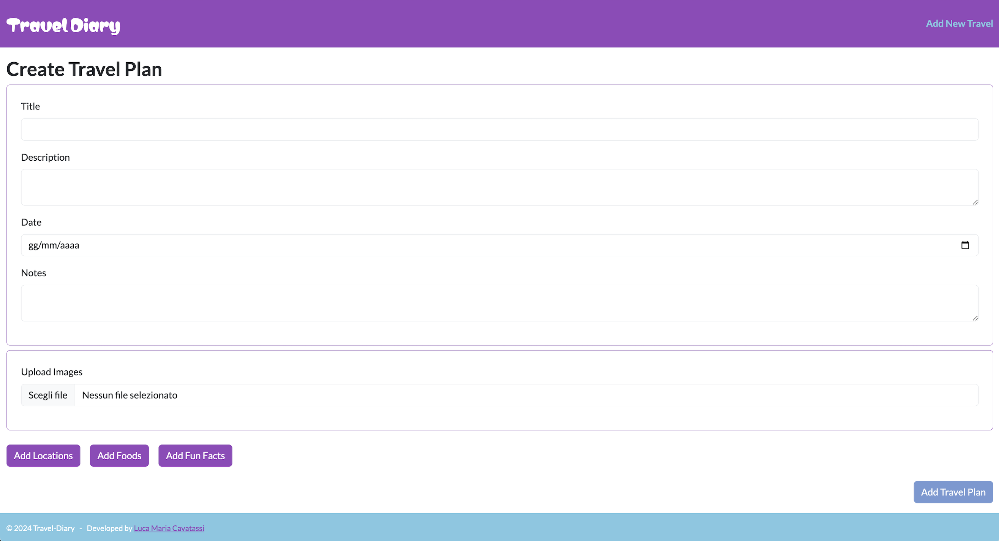
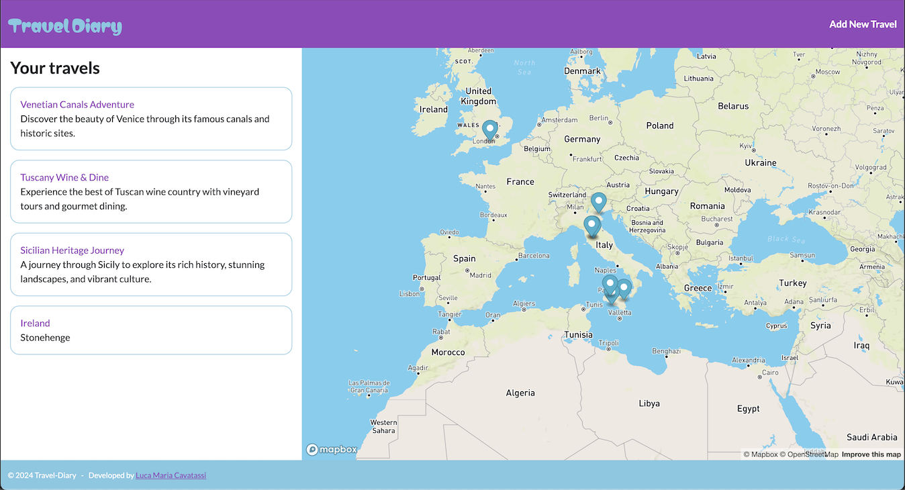

# Travel Planning and Management Web Application

This web application is designed to help you plan and manage your trips efficiently. It allows you to break down your journey into daily itineraries, where each day lists the places to visit. The application provides options to add details such as title, description, date, images, food recommendations, interesting facts, and any other relevant information.

## Features

1. **Daily Itineraries**: Organize your trip by creating day-by-day itineraries, each with a list of stops or points of interest (POIs).
2. **Detailed Information**: For each stop on your itinerary, you can add:
   - Title
   - Description
   - Date
   - Images
   - Food recommendations
   - Fun facts
   - Any other custom details
3. **Map Integration**: Each stop can be visualized on a map using a mapping service of your choice (e.g., Google Maps, Mapbox).
4. **Progress Tracking**: Keep track of your journey's progress, even if you close the webpage. The application will remember which stops you have visited.
5. **Trip Details Modal**: Open a detailed view of your trip or images in a modal for an enhanced viewing experience.
6. **Add Notes**: During your trip, you can add notes to each stop to remember important details or thoughts.
7. **Rating System**: After visiting a stop, you can rate it (e.g., from 1 to 5 stars) to evaluate your experience.

## Usage

1. Clone the repository from the hosting service.
2. Install necessary dependencies and run the application locally or on a server.
3. Start planning your trip by adding daily itineraries and stops.
4. Track your progress and enjoy your journey!

## Page Screenshots

### Home

### New Travel

